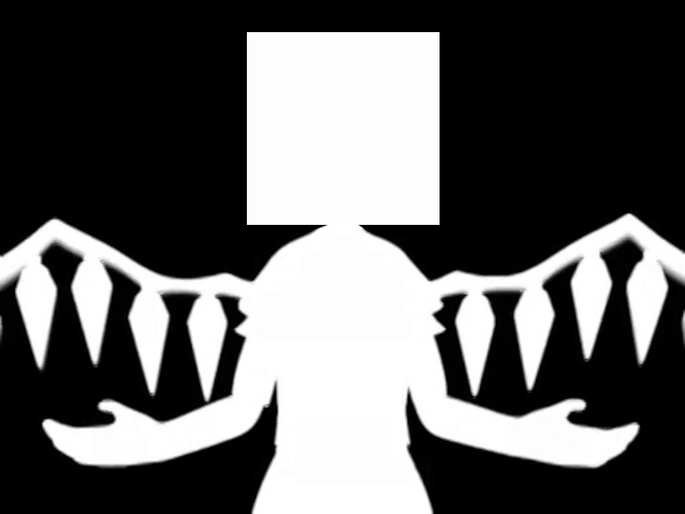

<!-- PROJECT LOGO -->
<br />
<p align="center">
  <a href="https://github.com/othneildrew/Best-README-Template">
    
  </a>


<!-- ABOUT THE PROJECT -->
## Bad Apple on a 3D Cube

https://www.youtube.com/watch?v=DapkoQFzG5M

Always wanted to make bad apple myself, and it was quite a fun challenge.
Also spent some time optimizing it with numba and i`m quite pleased with the results.
This uses blender`s particle system and changes particles (cubes in this case) position according to positions of white pixels in a video.


<!-- Installation -->
## Installation

This project uses python 3.9 and poetry.


1. Clone the repo
   ```sh
   git clone https://github.com/B0und/bad_apple_cube.git
   ```
2. Install dependencies with poetry
   ```python
   poetry install
   ```
   or install manually with pip:
   ```python
   pip install opencv-python,numba,numpy
   ```


<!-- USAGE EXAMPLES -->
## Usage

1. Find and download `Touhou_-_Bad_Apple.mp4`. (I used 480x360 video, if your is different resolutions look at the scripts and change the constants)


2. Use `python vid_to_frames.py` to convert video to jpeg images. 


3.  Run `python image_to_locations.py` to create cube location files for blender to use.

4. Open blender and add a particle system to a default Cube.

5. Go to the scripting tab at the top, create a new script and paste the contents of `blender_script.py`, edit the project location, size constants and run it. Warning: this script will take ~3GB of memory, so don`t run it on potato pc.

6. Play the animation.


<!-- LICENSE -->
## License

Distributed under the MIT License. See `LICENSE` for more information. 


